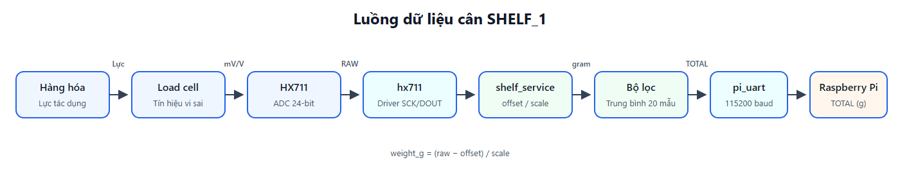
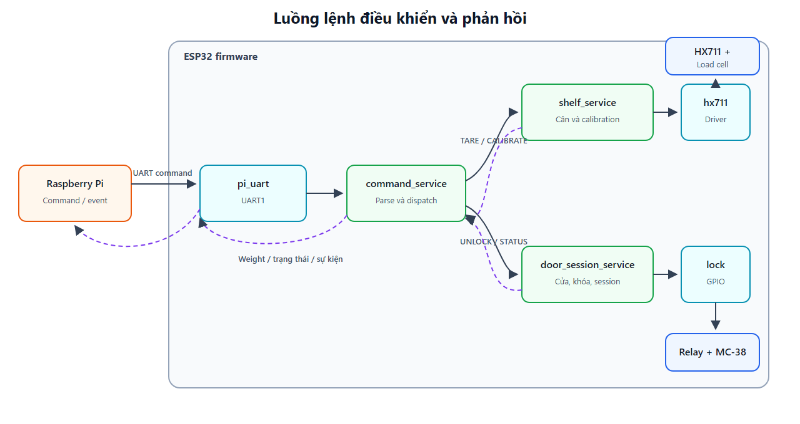
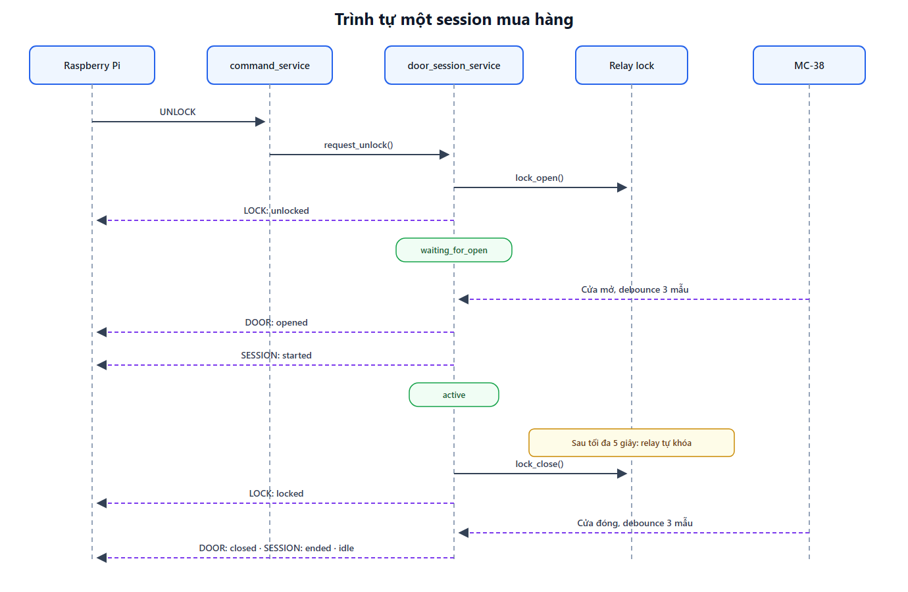
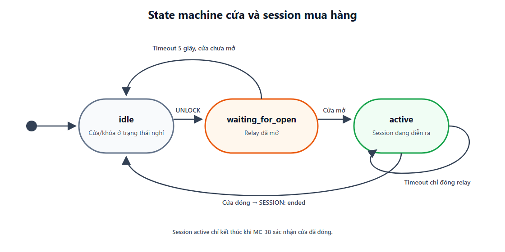
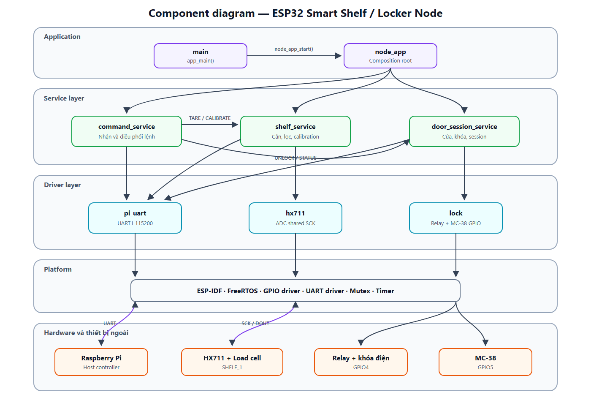

# Tài liệu tổng quan hệ thống và thiết kế phần mềm

## 1. Mục đích hệ thống

Hệ thống là một **ESP32 Node cho tủ bán hàng thông minh (Smart Shelf / Smart Locker)**. Node có nhiệm vụ đo khối lượng hàng hóa trên kệ, điều khiển khóa cửa, nhận biết trạng thái cửa và trao đổi dữ liệu với Raspberry Pi.

ESP32 xử lý các tác vụ thời gian thực ở tầng thiết bị. Raspberry Pi đóng vai trò bộ điều khiển cấp cao: gửi lệnh, nhận trạng thái và sử dụng dữ liệu khối lượng để xử lý nghiệp vụ mua hàng.

Trạng thái hiện tại của firmware:

- Hệ thống có hai shelf và hai HX711.
- Hai HX711 được khởi tạo, tare và đọc độc lập.
- `SHELF_1` dùng SCK GPIO25; `SHELF_2` dùng SCK GPIO26.

---

## 2. Hệ thống gồm những thành phần nào?

### 2.1. Thành phần phần cứng

| Thành phần | Vai trò | Kết nối chính |
|---|---|---|
| ESP32 | Bộ điều khiển thời gian thực của node | GPIO, UART |
| Load cell | Chuyển lực tác dụng trên mặt cân thành tín hiệu điện vi sai | Nối vào HX711 |
| HX711 | Khuếch đại và chuyển đổi tín hiệu load cell sang dữ liệu ADC 24-bit | `SCK`, `DOUT` |
| Relay/khóa điện | Mở hoặc đóng khóa cửa | Relay tại `GPIO4` |
| MC-38 | Xác định cửa đang đóng hay mở | Digital input tại `GPIO5` |
| Raspberry Pi | Gửi lệnh và nhận dữ liệu/trạng thái từ ESP32 | UART1, 115200 baud |
| Mặt cân và khung cơ khí | Truyền toàn bộ tải trọng vào load cell | Liên kết cơ khí |
| Nguồn cấp | Cấp nguồn cho ESP32, HX711 và mạch khóa | Theo thiết kế phần cứng |

### 2.2. Chân tín hiệu

| Chức năng | GPIO | Ghi chú |
|---|---:|---|
| HX711 `SHELF_1 SCK` | 25 | Clock độc lập của shelf 1 |
| HX711 `SHELF_1 DOUT` | 34 | Dữ liệu shelf 1 |
| HX711 `SHELF_2 SCK` | 26 | Clock độc lập của shelf 2 |
| HX711 `SHELF_2 DOUT` | 35 | Dữ liệu shelf 2 |
| Relay khóa | 4 | HIGH: mở khóa, LOW: đóng khóa |
| MC-38 | 5 | LOW: cửa đóng, HIGH: cửa mở |
| UART1 TX | 17 | ESP32 gửi dữ liệu tới Raspberry Pi |
| UART1 RX | 16 | ESP32 nhận lệnh từ Raspberry Pi |

> GPIO34 và GPIO35 trên ESP32 không có điện trở kéo lên/kéo xuống nội. Tín hiệu `DOUT` phải được điều khiển bởi HX711 đang được cấp nguồn.

### 2.3. Thành phần firmware

| Component | Trách nhiệm chính |
|---|---|
| `main` | Điểm vào chương trình, chỉ gọi `node_app_start()` |
| `node_app` | Khởi tạo và khởi chạy toàn bộ application service |
| `command_service` | Nhận, phân tích và điều phối lệnh từ UART hoặc console |
| `shelf_service` | Quản lý shelf, đọc cân, lọc, tare, calibrate và kiểm tra bốn góc |
| `door_session_service` | Quản lý trạng thái cửa, khóa và vòng đời session mua hàng |
| `hx711` | Driver đọc HX711; hỗ trợ mỗi converter sử dụng SCK riêng |
| `lock` | Driver GPIO cho relay khóa và cảm biến MC-38 |
| `pi_uart` | Driver UART giao tiếp với Raspberry Pi |

---

## 3. Firmware đảm nhận vai trò nào?

Firmware đảm nhận sáu nhóm chức năng chính:

1. **Khởi tạo phần cứng**
   - Khởi tạo UART1.
   - Khởi tạo hai giao tiếp HX711 độc lập.
   - Khởi tạo relay và cảm biến MC-38.

2. **Đo và xử lý khối lượng**
   - Chờ HX711 báo dữ liệu sẵn sàng.
   - Đọc dữ liệu signed 24-bit.
   - Chuyển đổi theo công thức:

     ```text
     weight_g = (raw - offset) / scale
     ```

   - Lọc trung bình trượt 20 mẫu.
   - Làm tròn khối lượng và đưa vùng gần zero về `0 g`.
   - Gửi giá trị mới sang Raspberry Pi khi khối lượng thay đổi.

3. **Hiệu chỉnh cân**
   - Tự tare `SHELF_1` khi khởi động.
   - Nhận lệnh `TARE` để xác lập lại zero.
   - Nhận lệnh `CALIBRATE:<grams>` để tính hệ số `scale`.
   - Đo cùng một vật tại bốn góc bằng `CORNER1` đến `CORNER4` và báo độ lệch bằng `CORNERCHECK`.

4. **Điều khiển khóa và theo dõi cửa**
   - Mở relay khi nhận `UNLOCK`.
   - Giới hạn thời gian mở khóa tối đa 5 giây.
   - Lọc dội tín hiệu MC-38 bằng ba mẫu liên tiếp, tương đương khoảng 60 ms.
   - Phát sự kiện cửa mở/đóng sang Raspberry Pi.

5. **Quản lý session mua hàng**
   - Chờ người dùng mở cửa sau lệnh `UNLOCK`.
   - Bắt đầu session khi cửa thực sự mở.
   - Kết thúc session khi cửa đóng lại.
   - Hủy trạng thái chờ nếu cửa không mở trong thời gian cho phép.

6. **Giao tiếp và chẩn đoán**
   - Nhận lệnh từ Raspberry Pi qua UART.
   - Cho phép nhập cùng lệnh qua console để kiểm thử.
   - Trả về trạng thái cửa, khóa, session và khối lượng hiện tại.
   - Ghi log chẩn đoán qua ESP-IDF logging.

---

## 4. Luồng dữ liệu tổng thể

### 4.1. Luồng dữ liệu cân



Luồng xử lý chi tiết:

1. Hàng hóa tạo lực lên mặt cân.
2. Load cell tạo tín hiệu điện vi sai rất nhỏ.
3. HX711 khuếch đại và chuyển đổi tín hiệu thành số signed 24-bit.
4. Driver `hx711` đọc giá trị `RAW`.
5. `shelf_service` trừ `offset`, chia cho `scale` và thu được gram.
6. Dữ liệu đi qua bộ lọc trung bình trượt.
7. Khi `TOTAL` thay đổi đủ lớn, dữ liệu được gửi sang Raspberry Pi.

### 4.2. Luồng lệnh điều khiển



### 4.3. Luồng một session mua hàng



Nếu cửa không mở trong vòng 5 giây, relay được đóng lại và state trở về `idle`; session không được bắt đầu.

---

## 5. Software architecture

Firmware sử dụng kiến trúc phân lớp kết hợp component-based architecture của ESP-IDF.

```text
┌─────────────────────────────────────────────────────────────┐
│                    Application entry                        │
│                   main/esp32_node.c                         │
├─────────────────────────────────────────────────────────────┤
│                 Application orchestration                   │
│                         node_app                            │
├─────────────────────────────────────────────────────────────┤
│                         Services                            │
│  command_service   shelf_service   door_session_service     │
├─────────────────────────────────────────────────────────────┤
│                          Drivers                            │
│             pi_uart       hx711       lock                  │
├─────────────────────────────────────────────────────────────┤
│                    ESP-IDF / FreeRTOS                       │
│       UART driver   GPIO driver   Tasks   Mutex   Timer      │
├─────────────────────────────────────────────────────────────┤
│                          Hardware                           │
│ Raspberry Pi   HX711/Load cell   Relay/Lock   MC-38         │
└─────────────────────────────────────────────────────────────┘
```

### 5.1. Quy tắc phụ thuộc

- `main` chỉ phụ thuộc `node_app`.
- `node_app` khởi động các service nhưng không chứa logic nghiệp vụ.
- `command_service` gọi API public của service, không điều khiển GPIO trực tiếp.
- `shelf_service` sử dụng `hx711` và `pi_uart`.
- `door_session_service` sử dụng `lock` và `pi_uart`.
- Driver phần cứng không phụ thuộc ngược lên service.

Cấu trúc này giúp thay đổi driver hoặc logic của một chức năng mà không làm `main` phình to hoặc tạo phụ thuộc vòng.

### 5.2. Mô hình thực thi FreeRTOS

| Task | Component | Chu kỳ/chế độ chờ | Stack | Priority | Vai trò |
|---|---|---:|---:|---:|---|
| `main_sensor_task` | `shelf_service` | Delay 20 ms; HX711 timeout 200 ms | 4096 | 5 | Đọc và xử lý khối lượng |
| `DOOR_SESSION` | `door_session_service` | Poll 20 ms | 3072 | 5 | Debounce cửa và quản lý session |
| `LOCK` | `command_service` | UART read timeout 20 ms | 4096 | 5 | Nhận lệnh UART từ Raspberry Pi |
| `CONSOLE` | `command_service` | Delay 10 ms khi không có ký tự | 4096 | 5 | Nhận lệnh thử nghiệm từ console |

### 5.3. Đồng bộ dữ liệu

- `shelf_mutex` ngăn task đọc cân chạy đồng thời với thao tác `TARE`, `CALIBRATE` hoặc `CORNER`.
- `state_mutex` bảo vệ trạng thái cửa, khóa và session giữa task cửa với lệnh `UNLOCK`/`STATUS`.
- Spinlock trong driver HX711 giữ 25 xung clock liên tục, tránh task khác kéo dài mức HIGH và làm HX711 vào power-down.

---

## 6. Software design

### 6.1. `main`

File `main/esp32_node.c` chỉ chứa điểm vào:

```c
void app_main(void) {
    node_app_start();
}
```

`main` không chứa logic thiết bị hoặc nghiệp vụ.

### 6.2. `node_app`

Trình tự khởi động:

```text
init_uart()
    ↓
shelf_service_init()
    ↓
door_session_service_init()
    ↓
shelf_service_start()
    ↓
door_session_service_start()
    ↓
command_service_start()
```

UART được khởi tạo trước để các service có thể gửi phản hồi ngay trong quá trình startup.

### 6.3. `shelf_service`

Trách nhiệm:

- Lưu cấu hình và runtime state của từng shelf.
- Khởi tạo hai HX711 với hai đường SCK độc lập.
- Warm-up 2 giây và bỏ 10 mẫu đầu.
- Tự tare `SHELF_1` và `SHELF_2`, mỗi shelf bằng tối đa 20 mẫu hợp lệ.
- Đọc, hiệu chỉnh, lọc và phát dữ liệu khối lượng.
- Thực hiện calibration với vật chuẩn.
- Ghi nhận và báo sai lệch bốn góc.

Các API public chính:

```c
void shelf_service_init(void);
void shelf_service_start(void);
float shelf_service_get_primary_total(void);
void shelf_service_tare_primary(void);
void shelf_service_calibrate_primary(float known_weight_g);
void shelf_service_record_corner(uint8_t corner_number);
void shelf_service_report_corner_deviation(void);
```

### 6.4. `door_session_service`

State machine gồm:



State `active` chỉ kết thúc khi MC-38 xác nhận cửa đã đóng. Việc relay tự đóng sau 5 giây không tự kết thúc session nếu cửa vẫn mở.

### 6.5. `command_service`

Hai nguồn lệnh dùng chung hàm `process_command()`:

- UART1 từ Raspberry Pi.
- Standard input từ ESP-IDF console.

Các lệnh hiện có:

| Lệnh | Kết quả |
|---|---|
| `PING` | Trả `READY` |
| `STATUS` | Trả trạng thái cửa, khóa, session và cân |
| `UNLOCK` | Yêu cầu mở khóa và chờ cửa mở |
| `TARE` | Lấy giá trị hiện tại của `SHELF_1` làm zero |
| `CALIBRATE:<grams>` | Tính lại `scale` từ vật chuẩn |
| `CORNER1` ... `CORNER4` | Ghi nhận khối lượng tại từng góc |
| `CORNERCHECK` | Tính trung bình và phần trăm lệch của bốn góc |

Ví dụ phản hồi trạng thái:

```text
STATUS: door=closed;lock=locked;session=idle;weight=206.0
```

### 6.6. `hx711`

Driver thực hiện:

- Chờ HX711 được chọn có `DOUT = LOW`.
- Phát 24 xung clock trên SCK riêng và đọc chân `DOUT` tương ứng.
- Sign-extend dữ liệu two's-complement 24-bit sang `int32_t`.
- Phát xung thứ 25 để chọn channel A, gain 128 cho lần chuyển đổi tiếp theo.
- Timeout sau 200 ms nếu converter chưa sẵn sàng.

### 6.7. `lock`

Driver cung cấp giao diện tối thiểu:

```c
void lock_open(void);
void lock_close(void);
bool is_door_closed(void);
```

Mọi logic session nằm trong `door_session_service`, không nằm trong driver GPIO.

### 6.8. `pi_uart`

UART1 được cấu hình:

```text
Baud rate : 115200
Data bits : 8
Parity    : None
Stop bits : 1
Flow ctrl : None
TX        : GPIO17
RX        : GPIO16
```

---

## 7. Component diagram



### Quan hệ giữa các component

```text
main
└── node_app
    ├── command_service
    │   ├── door_session_service
    │   ├── shelf_service
    │   └── pi_uart
    ├── door_session_service
    │   ├── lock
    │   └── pi_uart
    └── shelf_service
        ├── hx711
        └── pi_uart
```

---

## 8. Giao thức dữ liệu với Raspberry Pi

### 8.1. ESP32 gửi lên Raspberry Pi

```text
SHELF_1: TOTAL=206.0
LOCK: unlocked
LOCK: locked
DOOR: opened
DOOR: closed
SESSION: started
SESSION: ended
READY
STATUS: door=closed;lock=locked;session=idle;weight=206.0
CALIBRATE: OK scale=32.0000 raw_avg=123456
CORNERCHECK: avg=206.0g C1=... C2=... C3=... C4=...
```

Mỗi message kết thúc bằng ký tự newline `\n`.

### 8.2. Raspberry Pi gửi xuống ESP32

```text
PING
STATUS
UNLOCK
TARE
CALIBRATE:500
CORNER1
CORNER2
CORNER3
CORNER4
CORNERCHECK
```

---

## 9. Giới hạn và điểm cần cải tiến

1. **Hai shelf được đọc tuần tự**  
   Sensor task đọc `SHELF_1` rồi `SHELF_2`. Mỗi HX711 có SCK riêng nên timeout của một shelf không chặn shelf còn lại.

2. **Calibration chưa lưu bền vững**  
   `scale` tính bởi lệnh `CALIBRATE` chỉ tồn tại trong RAM. Sau reset, firmware dùng lại giá trị hardcoded trong source. Có thể cải tiến bằng NVS.

3. **Tare tự động khi startup**  
   Mặt cân phải trống trong lúc khởi động. Nếu có hàng trên mặt cân, khối lượng đó sẽ bị đưa vào offset.

4. **Bù sai lệch bốn góc**  
   Các lệnh `CORNER` chỉ đo sai lệch, không tự bù. Một load cell không thể chọn bốn hệ số theo vị trí nếu firmware không biết vật đang nằm ở đâu. Sai lệch lớn hoặc đổi dấu phải được xử lý ở cơ khí hoặc bằng load cell single-point có off-center compensation.

5. **UART parser còn đơn giản**  
   UART đang xử lý từng buffer bằng `strstr()`. Lệnh bị chia thành nhiều packet hoặc nhiều lệnh dính cùng buffer có thể bị xử lý không chính xác. Nên bổ sung line buffer theo ký tự `\n`.

6. **Cấu hình phần cứng đang hardcoded**  
   GPIO, số shelf và thông số calibration nằm trực tiếp trong source. Nên chuyển sang Kconfig hoặc một module cấu hình riêng khi sản phẩm ổn định.

7. **Độ chính xác phụ thuộc cơ khí**  
   Mặt cân phải đủ cứng, không chạm khung và chỉ truyền lực qua đúng đầu chịu tải của load cell. Phần mềm không thể sửa hoàn toàn lỗi do mặt cân cong, kẹt hoặc truyền lực sai.

---

## 10. Tóm tắt

ESP32 Node là tầng điều khiển thời gian thực của tủ bán hàng thông minh. Firmware đã được chia thành các software component có trách nhiệm rõ ràng:

- `shelf_service` quản lý cân.
- `door_session_service` quản lý cửa, khóa và session.
- `command_service` điều phối lệnh.
- `hx711`, `lock` và `pi_uart` cô lập truy cập phần cứng.
- `node_app` chỉ thực hiện composition và startup.
- `main` chỉ gọi hàm khởi động ứng dụng.

Thiết kế này giữ logic nghiệp vụ ra khỏi `main`, giảm phụ thuộc giữa các module và tạo nền tảng để mở rộng từ một shelf lên ba shelf trong các bước tiếp theo.
